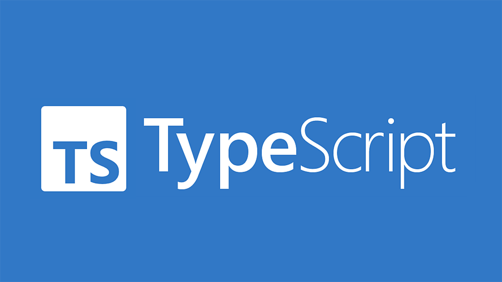

# array-methods-ts

Implementing core array methods from scratch in TypeScript 🔧💻 to explore how they work under the hood. A project that highlights my growth in TypeScript and algorithmic thinking 🚀, with a focus on clean, efficient code 🧑‍💻✨.
